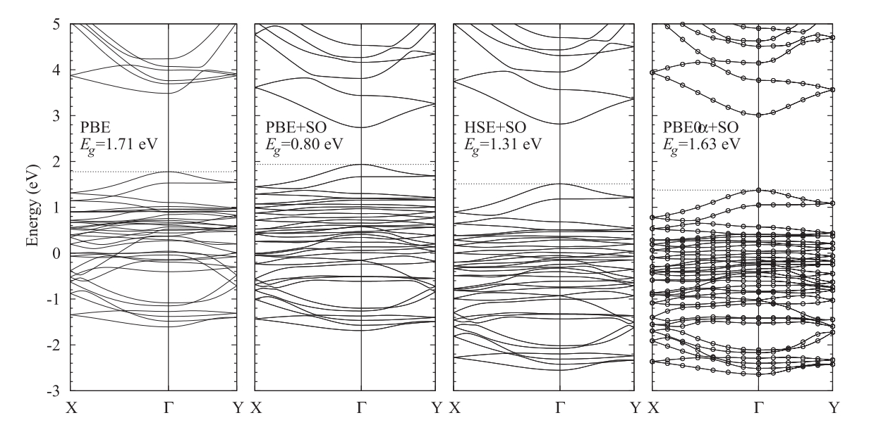

#背景简介

## 性能指标
* 带隙
* 吸光性能
* 载流子寿命
* 迁移率

# 带隙
* 使用杂化泛函可以明显提升精度：PBE0, HSE06
* 需要考虑spin-orbital (SO) coupling
* 可以调整杂化泛函的exact exchange比例(称为PBE0$\alpha$)：
   $\alpha = 1/\epsilon_\infty$
（$\epsilon_\infty是介电常数$）

例子：CH3NH3PbI3
* 实验值1.68eV
* 计算值

（PBE看起来不错，实际上是缺少HF交换和缺少SO的误差抵消，并不可靠）

